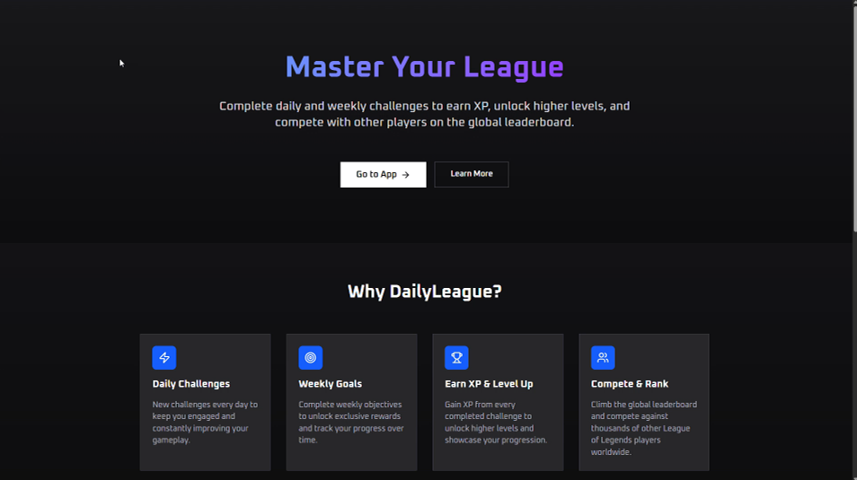
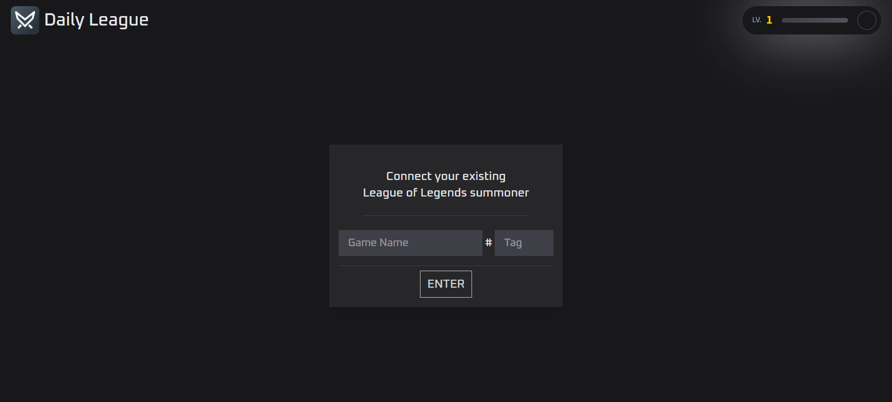
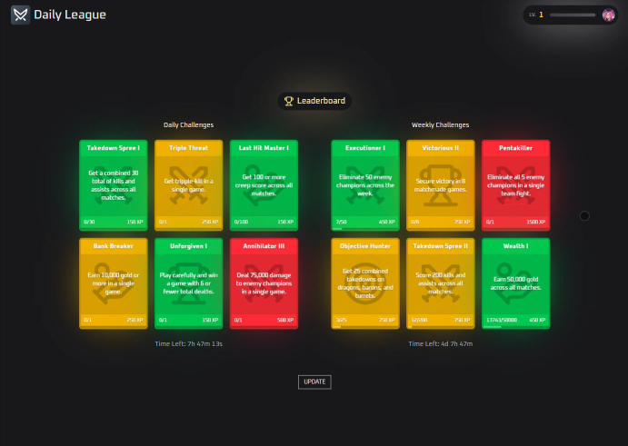
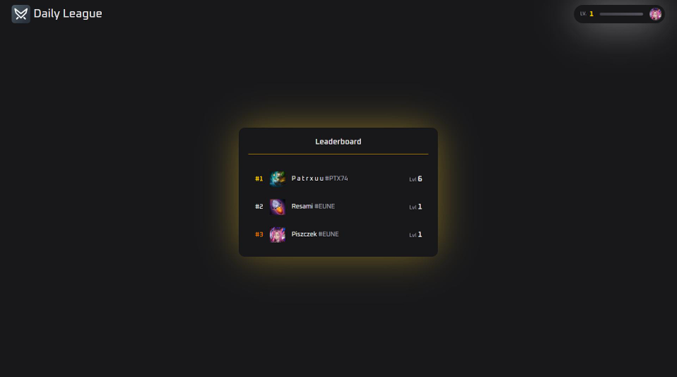

# Daily League


---

## Overview

League of Challenges is a gamified web application inspired by **League of Legends**, where users complete daily and weekly challenges to earn experience points, level up, and compete on a global leaderboard.

Each user receives dynamically generated challenges with a limited time window and automatic validation based on external game data.

---

## Features

- Daily and weekly challenge system
- Individually randomized challenges per user
- Time-limited challenge lifecycle
- Automatic challenge verification
- XP-based progression system
- Global leaderboard
- User profiles and statistics
- Authentication system
- Responsive UI

---

## Leveling System

User progression is based on a non-linear XP curve:

```text id="xp7k2q"
XP(level) = 5 × level³ + 50 × level² + 150 × level
```

This ensures that progression becomes increasingly difficult and long-term engagement is required to reach higher levels.

---

## Tech Stack

### Frontend / Fullstack Framework

- SvelteKit (Vite-based)

### Language

- TypeScript

### Backend / Database

- Prisma ORM
- MongoDB

### Authentication

- better-auth

### Validation

- Zod

### UI / Styling

- Tailwind CSS (v4)
- Bits UI
- Tailwind Merge
- Lucide Icons

### Tooling

- ESLint
- Prettier
- Svelte Check

### Deployment

- Vercel (`@sveltejs/adapter-vercel`)

---

## Installation

```bash id="install1"
npm install
```

---

## Development

```bash id="dev1"
npm run dev
```

Application runs at:

```text id="dev2"
http://localhost:5173
```

---

## Build

```bash id="build1"
npm run build
```

Preview production build:

```bash id="build2"
npm run preview
```

---

## Environment Variables

Create a `.env` file:

```bash id="env1"
cp .env.example .env
```

Required variables:

- `DATABASE_URL` – MongoDB connection string
- `RIOT_API_KEY` – Riot Games API key
- authentication-related secrets (from better-auth)

---

## Screenshots

### Home Page



### Connect with Riot Account



### Challenges



### Leaderboard



---

## Project Purpose

This project was created as a portfolio demonstration of:

- Full-stack architecture with SvelteKit
- Game-like progression systems
- Prisma + MongoDB database design
- Authentication system implementation (better-auth)
- External API integration (Riot Games API)
- Scalable challenge generation logic
- Modern UI development with Tailwind + component libraries

---

## Scripts

```bash id="scripts1"
npm run dev          # start dev server
npm run build        # production build
npm run preview      # preview build
npm run check        # type checking
npm run format       # format code
npm run lint         # lint + format check
```

---

## License

Portfolio / educational project.
